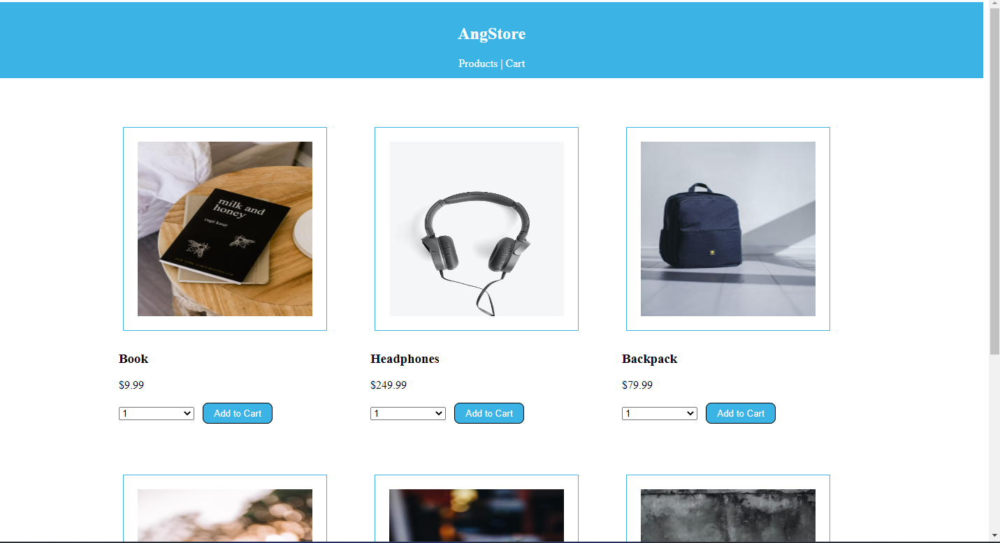

# Angstore

Angstore is a SPA written in angular 15. It renders a list of products that can be added to cart and checkedout.

## Functionalities

- Display list of products
- Add products to cart
- View products in cart
- Remove an item in cart
- Checkout products in the cart
- Display cart Total 

## Setup and Installation

Clone this repo [AngStore](https://github.com/oumao/angstore.git), **cd** into the root of the project and run `npm install` to install **dependencies**

## Starting the Server

On the same terminal/cmd run `ng serve`. Navigate to `http://localhost:4200` and view the project. 
